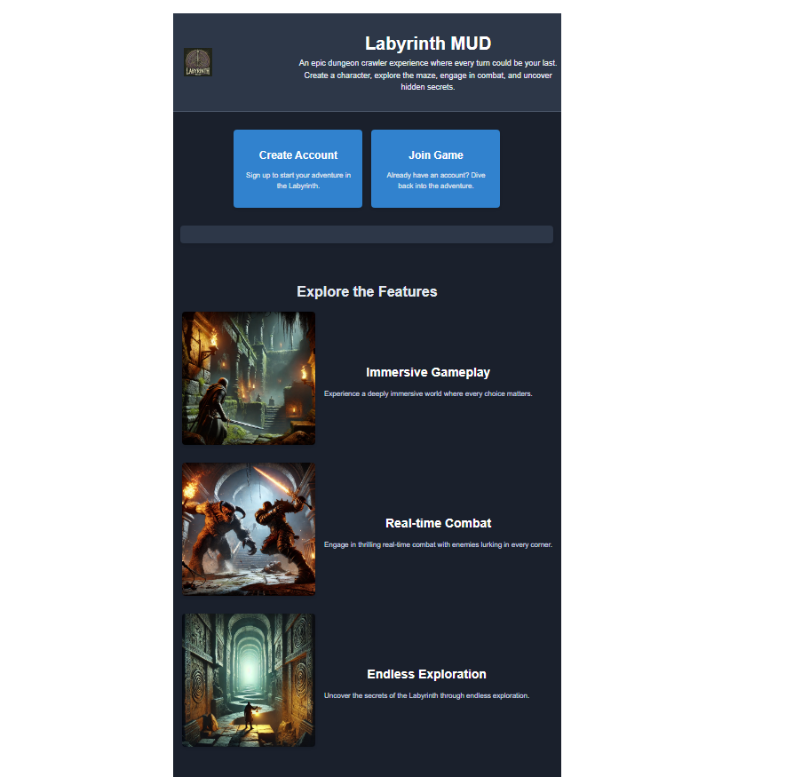

# Labyrinth




**Labyrinth** is a web application project that integrates a React frontend with a .NET Core Web API backend. The application utilizes Firebase for authentication and authorization, supporting roles such as User, Moderator, Administrator, and Owner. This project is structured to be easily extendable and maintainable, leveraging modern web development practices.

## Features

- **React Frontend**: A responsive and modern user interface built with React.
- **.NET Core API**: A robust and scalable backend API using .NET Core and Entity Framework.
- **Firebase Authentication**: Secure user authentication with Firebase, including role-based access control.
- **Role Management**: Support for multiple roles (User, Moderator, Administrator, Owner) with role-based access to API endpoints.
- **In-Memory Database for Development**: Simplifies development by using an in-memory database to avoid the need for a full SQL server during the initial stages.
- **Swagger Integration**: API documentation and testing interface available via Swagger.

## Getting Started

### Prerequisites

- **Node.js**: Install [Node.js](https://nodejs.org/) to manage dependencies for the React frontend.
- **.NET Core SDK**: Install the [.NET Core SDK](https://dotnet.microsoft.com/download) for the backend.
- **Firebase Account**: Set up a [Firebase](https://firebase.google.com/) account for authentication.

### Setup

1. **Clone the repository:**

   ```bash
   git clone https://github.com/wwestlake/Labyrinth.git
   cd Labyrinth
1. Install frontend dependencies:

Navigate to the React project directory and install the dependencies:

```
cd Labyrinth-UI
npm install
```

1. Configure Firebase:

Place your Firebase configuration file in the appropriate location within both the React frontend and the backend.
Ensure your secrets directory is not tracked by Git (as defined in .gitignore).
Run the React frontend:

```
npm start
```

1. Run the .NET Core backend:

Navigate to the backend project directory and run the API:

```
cd Labyrinth.API
dotnet run
```

1. Access the application:

Open your browser and navigate to http://localhost:3000 for the frontend.
The API can be accessed at https://localhost:7253 or the port specified in your launchSettings.json.

Testing
Unit Tests: The backend project includes unit tests that can be run using the .NET CLI:

bash
Copy code
dotnet test
Swagger UI: To test API endpoints, access the Swagger UI at https://localhost:7253/swagger once the backend is running.

Contributing
Contributions are welcome! Please feel free to submit a Pull Request.

## Contributing

Contributions are welcome! Please follow the steps below to clone the repository, make changes, and submit a pull request (PR) for review.
Also, [be sure to visit the wiki with loads of technical documents](https://github.com/wwestlake/Labyrinth/wiki). 

### Cloning the Repository

1. **Fork the Repository:**
   
   Go to the GitHub repository page and click the "Fork" button to create a copy of the repository under your own GitHub account.

2. **Clone the Forked Repository:**

   Clone the forked repository to your local machine using the following command:

   ```bash
   git clone https://github.com/YOUR-USERNAME/Labyrinth.git
   cd Labyrinth
1. Making Changes
Create a New Branch:

Before making any changes, create a new branch to work on:

```
git checkout -b feature/your-feature-name
Make Your Changes:
```

1. Make the necessary changes to the codebase.

Commit Your Changes:

After making changes, commit them to your branch:

```
git add .
git commit -m "Description of the changes made"
Push the Changes to Your Fork:
``` 

1. Push your changes to your forked repository on GitHub:


```
git push origin feature/your-feature-name
```
# Submitting a Pull Request
## Create a Pull Request:
Go to your forked repository on GitHub and click the "Compare & pull request" button. This will start the process of submitting a pull request to the original repository.

1. Describe Your Changes:

Provide a clear and concise description of your changes in the PR description. Include any relevant issue numbers if applicable.

1. Submit the Pull Request:

## Submit the pull request for review.

## Review Process
Once you have submitted your PR, it will be reviewed. You may receive feedback or requests for changes. Once the PR is approved, it will be merged into the main repository.


License
This project is licensed under the MIT License. See the LICENSE file for more details.

Contact
If you have any questions or feedback, feel free to reach out:

GitHub: wwestlake


